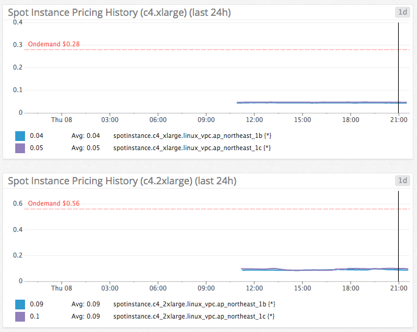

# Spotdog

[](https://travis-ci.org/dtan4/spotdog)
[](https://codeclimate.com/github/dtan4/spotdog)
[](https://codeclimate.com/github/dtan4/spotdog/coverage)
[](https://gemnasium.com/dtan4/spotdog)
[](http://badge.fury.io/rb/spotdog)
[](LICENSE)

__Spotdog__ is a command line tool to send EC2 Spot Instance Pricing History to Datadog. Spotdog enables us to monitor pricing history on Datadog.



## Supported Ruby version

Ruby 2.x

## Deploy to Heroku

See [__spotdog-heroku__](https://github.com/dtan4/spotdog-heroku) for details.

[](https://heroku.com/deploy?template=https://github.com/dtan4/spotdog-heroku)

## Local Installation

Add this line to your application's Gemfile:

```ruby
gem 'spotdog'
```

And then execute:

    $ bundle

Or install it yourself as:

    $ gem install spotdog

## Prerequisites

You need to set __AWS credentials__ and __Datadog API key__ as environment variables.

```bash
export AWS_ACCESS_KEY_ID=XXXXXXXXXXXXXXXXXXXX
export AWS_SECRET_ACCESS_KEY=xxxxxxxxxxxxxxxxxxxxxxxxxxxxxxxxxxxxxxxx
export AWS_DEFAULT_REGION=xx-yyyy-0

export DATADOG_API_KEY=xxxxxxxxxxxxxxxxxxxxxxxxxxxxxxxx
```

## Usage

```bash
$ spotdog help
Commands:
  spotdog help [COMMAND]  # Describe available commands or one specific command
  spotdog send            # Send spot instance price history
```

### Send spot instance price history (`spotdog send`)

```bash
$ spotdog help send
Usage:
  spotdog send

Options:
  i, [--instance-types=INSTANCE_TYPES]              # List of instance types
  m, [--max-results=N]                              # Number of results
  p, [--product-descriptions=PRODUCT_DESCRIPTIONS]  # List of product descriptions
  s, [--start-time=START_TIME]                      # The time which to start retriving the prices
  e, [--end-time=END_TIME]                          # The time which to stop retriving the prices
  l, [--last-minutes=N]                             # The duration in minutes which to retrive the prices
```

- `-i`, `--instance-type`
 - List of instance types, like `m4.large,c4.xlarge`.
- `-m`, `--max-results`
 - Number of results
- `-p`, `--product-descriptions`
 - List of product descriptions, like `linux_vpc,suse_vpc`. These values are allowed: `linux_vpc`, `linux_classic`, `suse_vpc`, `suse_classic`, `windows_vpc` and `windows_classic`.
- `-s`, `--start-time`
 - The time which to start retriving the prices, like `2015-10-06 18:00 JST`
- `-e`, `--end-time`
 - The time which to stop retriving the prices, like `2015-10-06 19:00 JST`
- `-l`, `--last-minutes`
 - The duration in minutes which to retrive the prices.

## Development

After checking out the repo, run `bin/setup` to install dependencies. You can also run `bin/console` for an interactive prompt that will allow you to experiment.

To install this gem onto your local machine, run `bundle exec rake install`. To release a new version, update the version number in `version.rb`, and then run `bundle exec rake release`, which will create a git tag for the version, push git commits and tags, and push the `.gem` file to [rubygems.org](https://rubygems.org).

## Contributing

Bug reports and pull requests are welcome on GitHub at https://github.com/dtan4/spotdog. This project is intended to be a safe, welcoming space for collaboration, and contributors are expected to adhere to the [Contributor Covenant](contributor-covenant.org) code of conduct.


## License

[](LICENSE)
